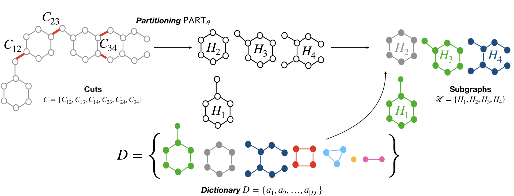

# The PnC graph compression framework
This is the official pytorch repository for the NeurIPS'21 paper *"Partition and Code: learning how to compress graphs"*
by Giorgos Bouritsas, Andreas Loukas, Nikolaos Karalias and Michael M. Bronstein

### [Paper](https://arxiv.org/abs/2107.01952) | [Slides](https://drive.google.com/file/d/1BShQTbSGei0AuoTV1b46GcXU1unRHerD/view?usp=sharing)

## Abstract
Can we use machine learning to compress graph data? The absence of ordering in graphs poses a significant challenge to conventional compression algorithms, limiting their attainable gains as well as their ability to discover relevant patterns. On the other hand, most graph compression approaches rely on domain-dependent handcrafted representations and cannot adapt to different underlying graph distributions. This work aims to establish the necessary principles a lossless graph compression method should follow to approach the entropy storage lower bound. Instead of making rigid assumptions about the graph distribution, we formulate the compressor as a probabilistic model that can be learned from data and generalise to unseen instances. Our "Partition and Code" framework entails three steps: first, a partitioning algorithm decomposes the graph into elementary structures, then these are mapped to the elements of a small dictionary on which we learn a probability distribution, and finally, an entropy encoder translates the representation into bits. All three steps are parametric and can be trained with gradient descent. We theoretically compare the compression quality of several graph encodings and prove, under mild conditions, a total ordering of their expected description lengths. Moreover, we show that, under the same conditions, PnC achieves compression gains w.r.t. the baselines that grow either linearly or quadratically with the number of vertices. Our algorithms are quantitatively evaluated on diverse real-world networks obtaining significant performance improvements with respect to different families of non-parametric and parametric graph compressors.


## Dependencies and Installation Instructions

Requirements:
- python 3.8.8
- pytorch>=1.8.0
- cudatoolkit>=10.2
- pytorch geometric>=1.6.3
- graph-tool>=2.37 (SBMs, dictionary atoms, etc.)
- scikit-network (partitioning algorithms)
- timeout_decorator
- wandb (optional: experiment monitoring)
- xlrd (optional: in case you want to precompute the subgraphs with subgraph isomorphism, we use it to keep track of their locations)
- xlutils (optional: as above)
- ogb (optional: in case you want to compress ogb datasets)

Recommended setup installations
```
conda create --name PnC python=3.8 
conda activate PnC
conda install pytorch==1.8.0 cudatoolkit=10.2 -c pytorch
pip install torch-scatter -f https://pytorch-geometric.com/whl/torch-1.8.0+cu102.html
pip install torch-sparse -f https://pytorch-geometric.com/whl/torch-1.8.0+cu102.html
pip install torch-cluster -f https://pytorch-geometric.com/whl/torch-1.8.0+cu102.html
pip install torch-geometric
conda install -c conda-forge graph-tool
pip install scikit-network
pip install timeout_decorator
pip install wandb
---  optional ---
pip install xlrd
pip install xlutils
pip install ogb
```
## Datasets

- **TUDatasets**: we provide the datasets originally obtained from [here](https://github.com/weihua916/powerful-gnns), 
as well as the splits that we used to evaluate PnC. 
- **ZINC**: we provide the split obtained from the official [repo](https://github.com/graphdeeplearning/benchmarking-gnns). 
PLease download the dataset by running:
```
cd ./datasets/chemical/ZINC/
curl https://www.dropbox.com/s/feo9qle74kg48gy/molecules.zip?dl=1 -o molecules.zip -J -L -k
unzip molecules.zip -d ./
```
To reproduce the results from the paper, set ```--dataset <dataset> --dataset_name <dataset_name> --split given```,
where dataset = {bioinformatics, social, chemical}, dataset_name = {MUTAG, PROTEINS, PTC, ZINC, IMDBBINARY, IMDBMULTI}.
We also provide infrastructure to compress other common datasets in the GNN literature
(see the file [utils/generate_dataset.py](https://github.com/gbouritsas/PnC/blob/master/utils/generate_dataset.py) for more details)

## Usage Examples

The example commands below are selected to reproduce the numbers from Table 1 in the paper 
(expected results: 4.80, 2.51 and 2.45 total bpe respectively). 
We also provide an example command for compression of attributed graphs (expected result 4.45 total bpe). 
Finally, we give an example of out of distribution compression, where we train a neural compressor on MUTAG and test on ZINC (expected result: 2.63 total bpe)

### Baselines
In the baselines folder we provide the computations needed to obtain the description lengths of the non-parametric models (null models and pure-partitioning based).
For example, the following command will compute the description length of the MUTAG dataset after compressing via partitioning with the Louvain algorithm.
```Louvain partitioning
cd baselines
python non_parametric_models.py --dataset bioinformatics --dataset_name MUTAG --non_parametric_model Louvain --modified_gt_entropy False
```
- To reproduce the rest of the results from the tables in the paper,
simply set the parameter ```--non_parametric_model``` 
to one of the following values ```{uniform, edge_list, erdos_renyi, sbm, Louvain, PropagationClustering}``` 

- **NB**: The description length of the partitioning-based baselines is a modified version of the entropy function provided by graph-tool. 
In graph-tool, the dl is computed for labelled graphs, while we are intersted in compressing unlabelled graphs. 
Thus, with our modification we drop the terms related to the ordering of the nodes (log n! - Σlog n_i!) (L164 in [baselines/non_parametric_models.py](https://github.com/gbouritsas/PnC/blob/master/baselines/non_parametric_models.py)).
In order to also fit an SBM w.r.t. the modified description length, one should modify the [blockmodel.py](https://git.skewed.de/count0/graph-tool/-/blob/release-2.37/src/graph_tool/inference/blockmodel.py) file of graph-tool (L1112 in the [reference implementation](https://github.com/gbouritsas/PnC/blob/master/baselines/blockmodel.py)).
In case you don't modify the graph-tool function, please set ```--modified_gt_entropy False``` in order to do the description length correction inside the script.

### PnC

#### PnC + predefined partitioning algorithm
In the PnC_fixed_part folder we provide the training for the PnC + fixed partitioning variants,
where we use a precomputed partitioning and then learn the dictionary and the parameters of the probability distribution.
Example command:
``` PnC + Louvain
cd PnC_fixed_part
python PnC_fixed_part.py --batch_size=1 --partitioning_algorithm=Louvain --dataset=bioinformatics --dataset_name=MUTAG --lr_dict=1 --num_epochs 50 --n_h_max_dict=10 
```
We provide implementation for the following partitioning algorithms: 
partitioning_algorithm = {sbm, Louvain, PropagationClustering} (please refer to the paper for more details). 

#### PnC + Neural Partitioning
In the PnC_neural_part folder we provide the implementation for our neural partitioning algorithm
(iterative subgraph selection - please refer to the paper for more details).
Example command:
```
cd PnC_neural_part
python PnC_neural_part.py --batch_size=16 --d_out=16 --num_layers 2 --dataset=bioinformatics --dataset_name=MUTAG --lr_dict=0.1 --lr_policy=0.001 --n_h_max_dict=10
```

#### PnC for attributed graphs
PnC can also compress attributed graphs. Here we provide a proof of concept implementation,
that encodes the attributes using a uniform distribution. In our experiments we used the attributed MUTAG and PTC_MR datasets.
Example command:
```
cd PnC_fixed_part
python PnC_fixed_part.py --batch_size=1 --partitioning_algorithm=Louvain --dataset=TUDataset --dataset_name=MUTAG --lr_dict=1 --n_h_max_dict=-1 --num_epochs 50 --node_attr_encoding uniform --edge_attr_encoding uniform
```

#### Out-of-distribution experiments
To compress different distributions using a pretrained neural compressor, you need to do the following:
1. Before training, define ```--n_max```, i.e., the upper bound on the number of vertices, 
   such that it is at least as large as the largest graph in the target distribution (this can be avoided - see the notes below to find out how). 
2. Train the neural compressor in the dataset of your choice.
3. Test on a different distribution by resuming from the appropriate folder.
For example:
```
cd PnC_neural_part
python PnC_neural_part.py --batch_size=16 --d_out=16 --num_layers 2 --degree_as_tag False --dataset=bioinformatics --dataset_name=MUTAG --lr_dict=0.1 --lr_policy=0.001 --n_h_max_dict=10 --results_folder ood_experiments --n_max 37
(...training...)
python PnC_neural_part.py --batch_size=16 --d_out=16 --num_layers 2 --degree_as_tag False --dataset=chemical --dataset_name=ZINC --n_h_max_dict=10 --n_max 37 --resume_folder ../datasets/bioinformatics/MUTAG/results/ood_experiments/0/MPNN_sparse/checkpoints --resume True --mode test
```


## Important files    
- [environment.py](https://github.com/gbouritsas/PnC/blob/master/encoding_decoding/environment.py)
  is the main module from which we coordinate the neural compressor, 
  i.e., it defines the encoding schemes, keeps track of the dictionary and updates it, 
  maps subgraphs to dictionary atoms, computes the description length, etc.
- [encoding_costs.py](https://github.com/gbouritsas/PnC/blob/master/encoding_decoding/encoding_costs.py) 
  implements various parametric and non-parametric encodings as the ones we have used in the paper.
- [probabilistic_model.py](https://github.com/gbouritsas/PnC/blob/master/models/probabilistic_model.py) 
  contains the implementation of the learnable parameters of the dictionary (membership variables) and those of the probabilistic model.
- [agent_fixed_part.py](https://github.com/gbouritsas/PnC/blob/master/PnC_fixed_part/agent_fixed_part.py) and
  [agent_neural_part.py](https://github.com/gbouritsas/PnC/blob/master/PnC_neural_part/agent_neural_part.py) 
  implement the partitioning algorithms (fixed and learnable respectively)
- [train_fixed_part.py](https://github.com/gbouritsas/PnC/blob/master/PnC_fixed_part/train_fixed_part.py) and
  [train_neural_part.py](https://github.com/gbouritsas/PnC/blob/master/PnC_neural_part/train_neural_part.py) 
  train the neural compressor and log intermediate results and visualisations.
- [GNN_neural_part_subgraph_selection.py](https://github.com/gbouritsas/PnC/blob/master/models/GNN_neural_part_subgraph_selection.py)
  implements the parametrisation of the randomised algorithm.


## Notes
- **Experiment logging**: We used the [wandb](https://wandb.ai/site) platform to log the output of our experiments.
  You can disable it by setting the following command line parameter ```--wandb False```.
  Otherwise, you can log your experiments to your own account by setting the following 
  ```--wandb True --wandb_project <project_name> --wandb_entity <account_name>```. 
  Additionally, you can get realtime updates by setting  ```--wandb_realtime True``` and visualise the subgraphs that are progressively discovered by the partitioning algorithm,
  as well as example decompositions by setting
  ```--visualise True --inds_to_visualise 3,4 ``` (e.g., graphs 3 and 4 in the first batch in the test will be visualised). 
  However, note that realtime logging is going to slow-down your training.
- **gnn_layers**: our repository contains implementations in pytorch geometric and with torch sparse operations (for completely reproducible results).
  Set ```model_name={MPNN, MPNN_sparse}``` to switch between the two (also {MPNN_edge, MPNN_edge_sparse} for GNNs that take edge features into account).
  Regarding the details of the GNN, we provide implementations for GIN (sum aggregation and mlp update function) 
  and for a general MPNN (both the message and the update function are mlps).
  The selection is done as follows: ```--aggr_fn={gin, general}```.
- ```--n_max``` is the only upper bound that needs to be pre-specified (we compute it from the dataset). 
Note: This encodes the number of vertices as if they originated from a uniform distribution.
Other encoding types do not require an upper bound, e.g., see [here](https://en.wikipedia.org/wiki/Universal_code_(data_compression)) for alternatives.
- ```--n_h_max``` is an upper bound on the number of vertices of each subgraph, 
  while ```--n_h_max_dict``` is an upper bound on the number of vertices of dictionary subgraphs 
  (this needs to be small).
- **Other parameters of interest**: ```--lr_dict``` (learning rate for the dictionary and the probabilistic model updates),
  ```--lr_policy``` (GNN learning rate for the NeuralPart).

## Predefined/Initial universe
Finally, we provide functionality that allows the user to predefine an initial universe of possible atoms.
Then, the universe can either remain fixed by setting ```--universe_type fixed```,
or get augmented by the output of the partitioning algorithm. 
This can be particularly helpful when there is prior knowledge about frequent (or "important")
substructures in the graph distribution and we would like our compressor to focus on them.

The initial universe can be defined in multiple ways
(similar to the [GSN repository](https://github.com/gbouritsas/graph-substructure-networks#how-to-define-the-substructures)):
1. Via [networkx generators](https://networkx.org/documentation/stable/reference/generators.html) (cycle_graph, path_graph etc.). 
   Here you can either define all graphs from a certain family up to a maximum number of vertices 
   (e.g., ```--atom_types cycle_graph --k 6```), or one graph with a fixed number of vertices
   (e.g., ```--atom_types cycle_graph_chosen_k --k 6```).
   Please refer to the file [prepare_dictionary.py](https://github.com/gbouritsas/PnC/blob/master/utils/prepare_dictionary.py)
   to find out the supported graph families (the code can be easily extended to support other networkx generators).
2. All simple graphs of a certain size (connected) which you need to download from [here](https://users.cecs.anu.edu.au/~bdm/data/graphs.html) 
and save in the [./datasets/all_simple_graphs/](https://github.com/gbouritsas/PnC/blob/master/datasets/all_simple_graphs) folder. 
   As above, possible usage examples are
   ```--atom_types all_simple_graphs --k 6```, ```--atom_types all_simple_graphs_chosen_k --k 6```
3. Custom (connected) graphs. E.g., for a 3-path: ```--atom_types custom --custom_edge_lists 0,1,,1,2```
4. Motifs of the graph distribution, where we define the universe based on the existing induced subgraphs of size up to k in the distribution:
```--atom_types motifs --k 6```
5. A combination of the above, e.g., ```--atom_types cycle_graph,path_graph_chosen_k --k 6,4``` 

# Citation

```
@InProceedings{bouritsas2021partition,
    title={Partition and Code: learning how to compress graphs},
    author={Bouritsas, Giorgos and Loukas, Andreas and Karalias, Nikolaos and Bronstein, Michael M},
    booktitle = {Advances in Neural Information Processing Systems},
    year = {2021}
}
```

